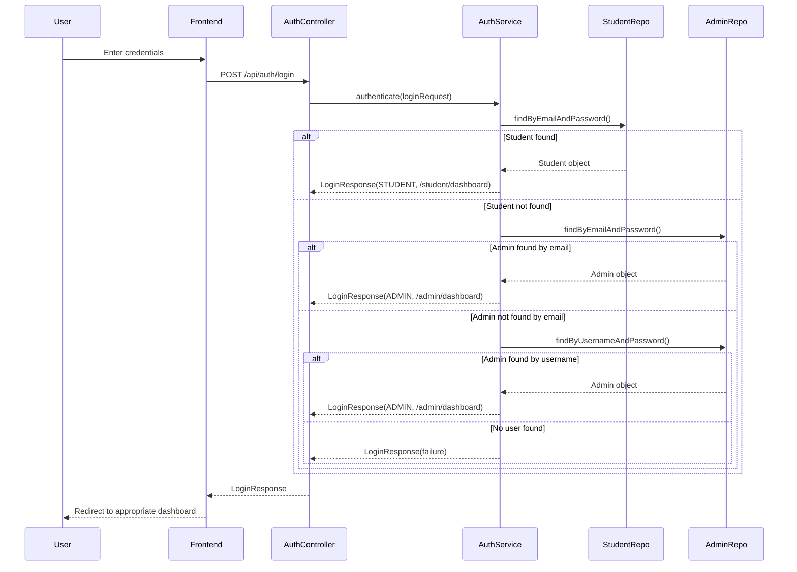

# Student Trade - Unified Login System

This document explains how the unified login system works for the Student Trade application, where both students and administrators use the same login page but are redirected to different dashboards based on their role.

## Overview

The login system allows:
- **Students** to login using their email and password
- **Administrators** to login using either email or username and password
- Both user types use the same login page (`/login.html`)
- Automatic role detection and redirection to appropriate dashboards
- Secure authentication with proper error handling

## Architecture

### Backend Components

#### 1. DTOs (Data Transfer Objects)
- **`LoginRequest.java`**: Contains email/username and password for login requests
- **`LoginResponse.java`**: Contains authentication result, user info, role, and redirect URL

#### 2. Authentication Service
- **`AuthenticationService.java`**: Interface defining authentication contract
- **`AuthenticationServiceImpl.java`**: Implementation that handles login logic

#### 3. Repository Updates
- **`StudentRepository.java`**: Added `findByEmailAndPassword()` method
- **`AdministratorRepository.java`**: Added authentication methods for both email and username

#### 4. Controller
- **`AuthController.java`**: REST endpoint for handling login requests at `/api/auth/login`

### Frontend Components

#### 1. Login Page (`/login.html`)
- Unified login form for both students and admins
- Modern, responsive design
- Real-time validation and error handling
- Automatic redirection based on user role

#### 2. Dashboards
- **Student Dashboard** (`/student-dashboard.html`): Student-specific features
- **Admin Dashboard** (`/admin-dashboard.html`): Administrative features

## How It Works

### 1. Login Process



### 2. Authentication Flow

1. **User submits login form** with email/username and password
2. **Frontend sends POST request** to `/api/auth/login`
3. **AuthenticationService processes the request**:
   - First tries to authenticate as a student using email
   - If not found, tries to authenticate as admin using email
   - If still not found, tries to authenticate as admin using username
4. **Returns LoginResponse** with:
   - Success/failure status
   - User role (STUDENT/ADMIN)
   - Redirect URL
   - User information
5. **Frontend redirects** to appropriate dashboard based on role

### 3. Role-Based Redirection

| User Type | Login Method | Redirect URL | Dashboard Features |
|-----------|--------------|--------------|-------------------|
| Student | Email + Password | `/student-dashboard.html` | Product management, transactions, profile |
| Admin | Email/Username + Password | `/admin-dashboard.html` | User management, system monitoring, analytics |

## API Endpoints

### POST `/api/auth/login`

**Request Body:**
```json
{
    "emailOrUsername": "user@example.com",
    "password": "password123"
}
```

**Success Response (Student):**
```json
{
    "success": true,
    "message": "Student login successful",
    "role": "STUDENT",
    "redirectUrl": "/student/dashboard",
    "userId": "ST123456",
    "name": "John Doe"
}
```

**Success Response (Admin):**
```json
{
    "success": true,
    "message": "Admin login successful",
    "role": "ADMIN",
    "redirectUrl": "/admin/dashboard",
    "userId": "1",
    "name": "admin_user"
}
```

**Error Response:**
```json
{
    "success": false,
    "message": "Invalid credentials. Please check your email/username and password.",
    "role": null,
    "redirectUrl": null,
    "userId": null,
    "name": null
}
```

## Security Features

1. **Input Validation**: All inputs are validated on both frontend and backend
2. **Error Handling**: Comprehensive error handling with user-friendly messages
3. **CORS Support**: Cross-origin requests are supported for frontend integration
4. **Session Management**: User information stored in localStorage (can be enhanced with JWT tokens)

## Database Schema

### Student Table
```sql
CREATE TABLE student (
    student_id VARCHAR(255) PRIMARY KEY,
    first_name VARCHAR(255) NOT NULL,
    last_name VARCHAR(255) NOT NULL,
    email VARCHAR(255) NOT NULL,
    password VARCHAR(255) NOT NULL,
    residence_id BIGINT,
    -- other fields...
);
```

### Administrator Table
```sql
CREATE TABLE administrator (
    admin_id BIGINT AUTO_INCREMENT PRIMARY KEY,
    username VARCHAR(255),
    email VARCHAR(255),
    password VARCHAR(255),
    -- other fields...
);
```

## Usage Examples

### Testing Student Login
```bash
curl -X POST http://localhost:7090/api/auth/login \
  -H "Content-Type: application/json" \
  -d '{
    "emailOrUsername": "student@university.edu",
    "password": "studentpass123"
  }'
```

### Testing Admin Login
```bash
curl -X POST http://localhost:7090/api/auth/login \
  -H "Content-Type: application/json" \
  -d '{
    "emailOrUsername": "admin",
    "password": "adminpass123"
  }'
```

## Frontend Integration

### Accessing the Login Page
Navigate to `http://localhost:7090/login.html`

### Dashboard Access
- Students: `http://localhost:7090/student-dashboard.html`
- Admins: `http://localhost:7090/admin-dashboard.html`

## Future Enhancements

1. **Password Hashing**: Implement BCrypt or similar for password security
2. **JWT Tokens**: Add JWT-based authentication for stateless sessions
3. **Password Reset**: Implement password reset functionality
4. **Two-Factor Authentication**: Add 2FA for enhanced security
5. **Session Management**: Implement proper session handling with Redis
6. **Rate Limiting**: Add rate limiting to prevent brute force attacks

## Troubleshooting

### Common Issues

1. **Login fails for valid credentials**
   - Check database connection
   - Verify user exists in database
   - Check password format

2. **CORS errors**
   - Ensure `@CrossOrigin(origins = "*")` is configured
   - Check frontend URL configuration

3. **Dashboard access denied**
   - Verify user role in localStorage
   - Check if user is properly authenticated

### Debug Endpoints

- **Health Check**: `GET /api/auth/health`
- **Database Check**: Verify tables exist and contain data

## Conclusion

This unified login system provides a seamless experience for both students and administrators while maintaining proper role-based access control. The system is designed to be secure, scalable, and easy to extend with additional features.